# ethereum scaling diagram

Diagrams of the Eth2 beacon node, validator client, Eth1 engine and more.
Drawn with [diagrams.net](https://diagrams.net) (*previously draw.io*).

[**> Full poster diagram here <**](./ethereum-scaling-diagram.svg)

## Diagrams

*Disable dark-mode github for clear box outlines.*

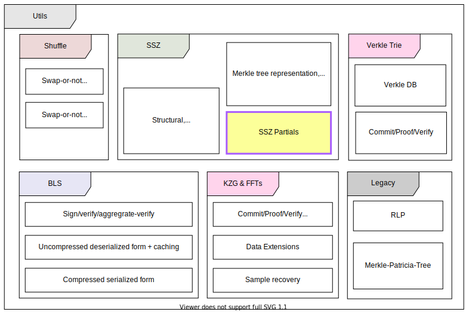
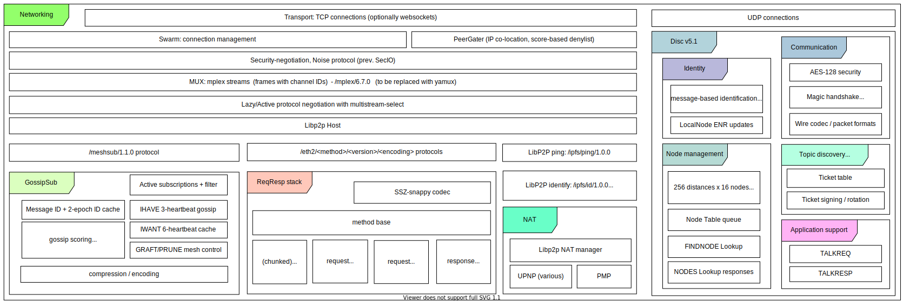
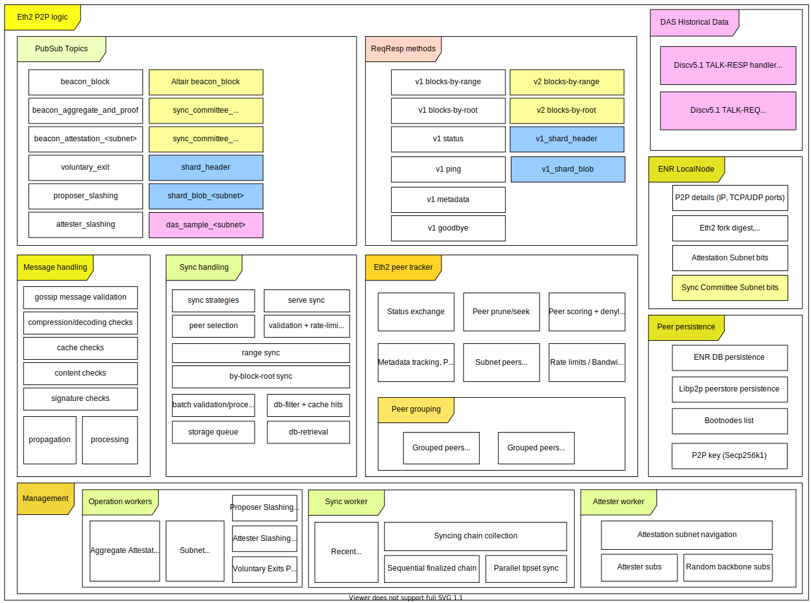
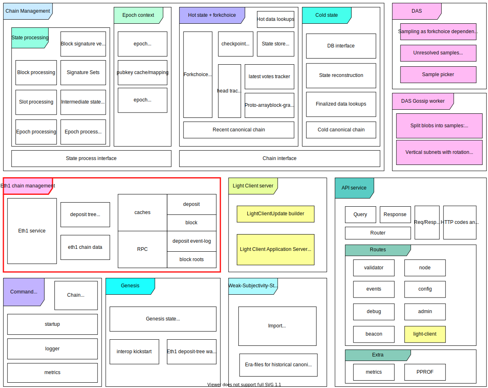
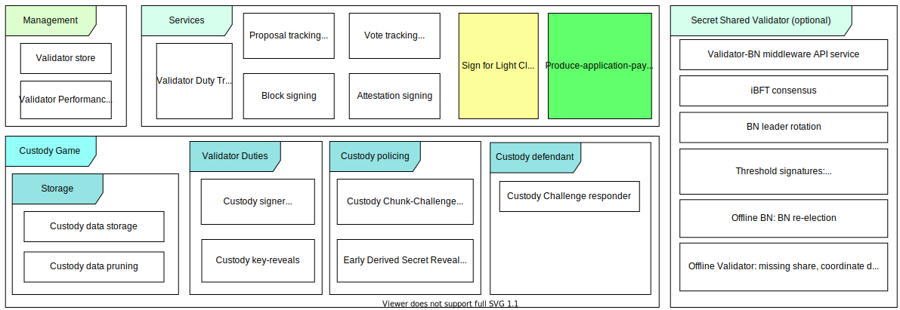
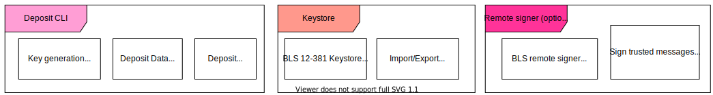
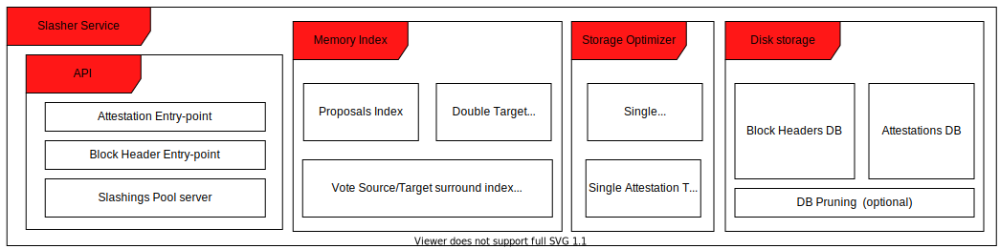
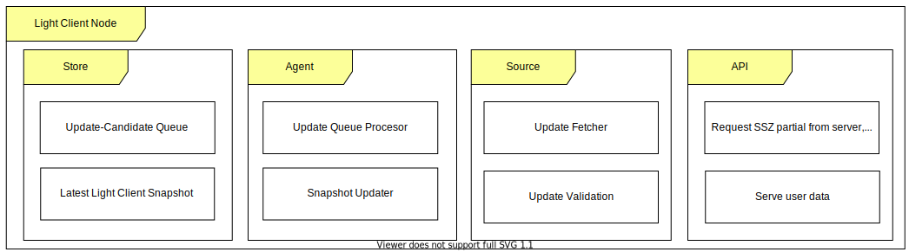
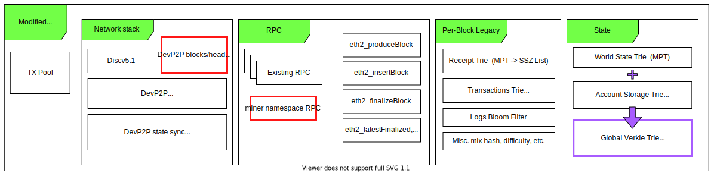
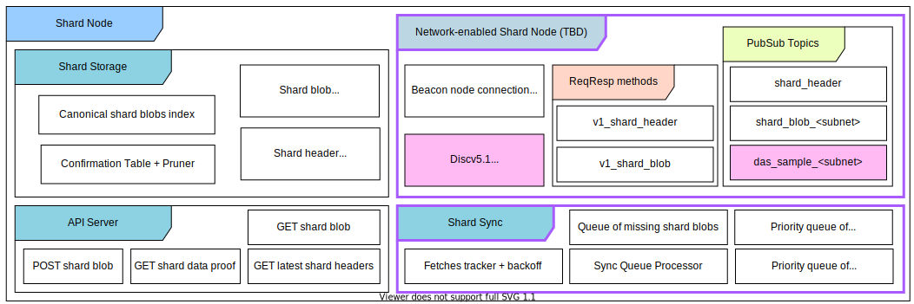
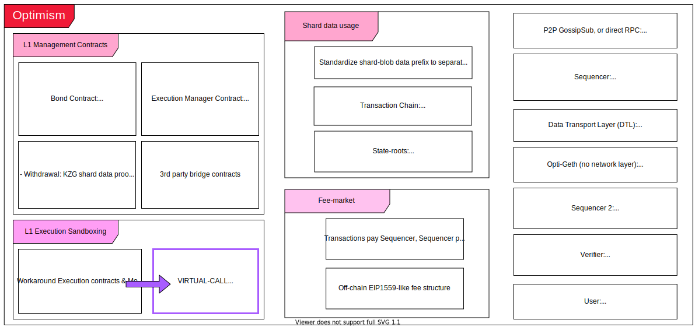
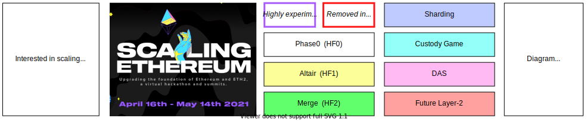

## License

CC BY 4.0, see [`LICENSE`](./LICENSE) file.
